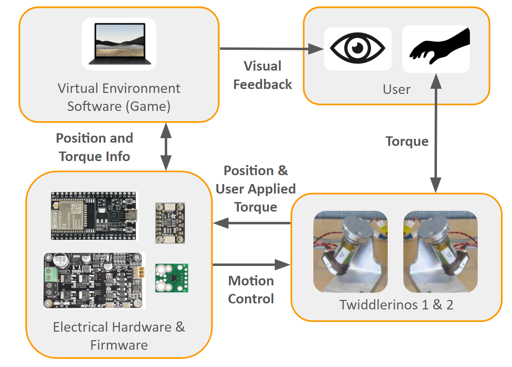
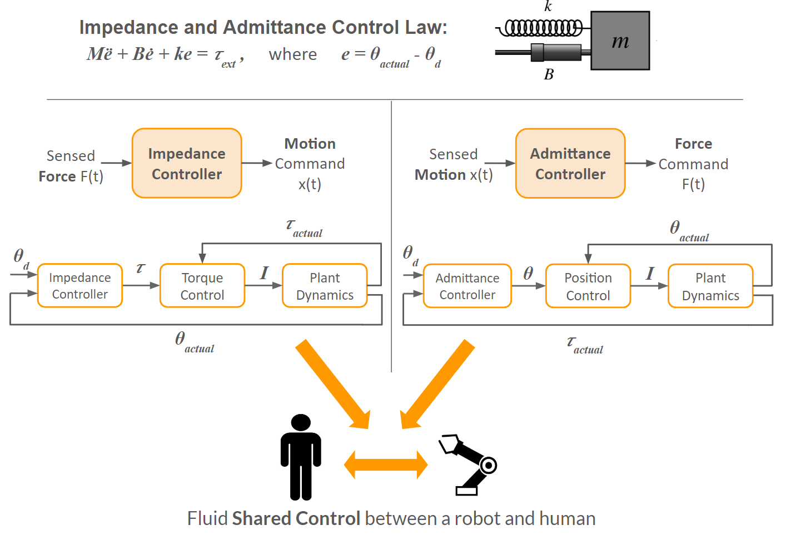
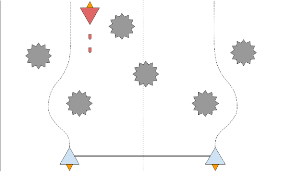
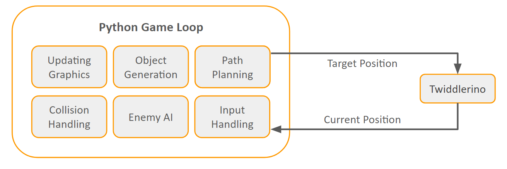
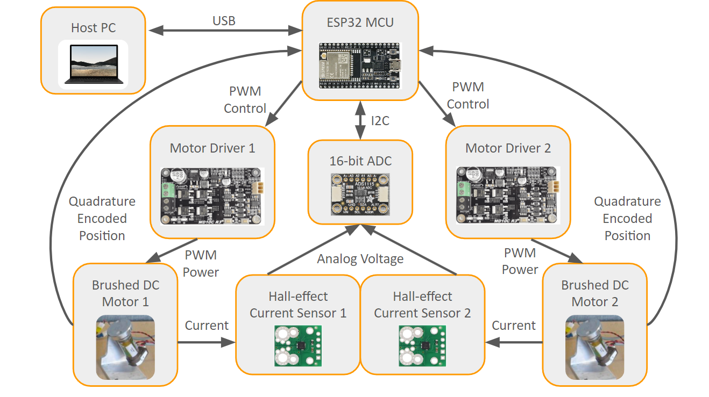
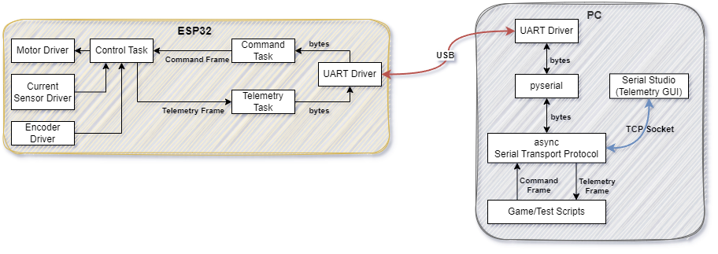
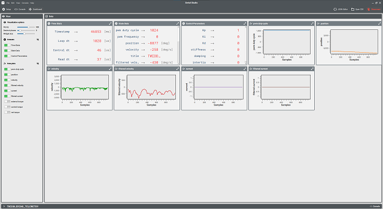

# HapticCopiloting
Codebase for UBC's ENPH-459 (Engineering Physics) Capstone Project: **Haptic Shared Control**

Demonstrating complex human-robot control through a 1 DOF haptic device featuring a BDC motor control system in live feedback with a virtual environment.

Authors: 
* Gavin Pringle
* Yousif El-Wishahy
* Sayeh Oloumi Yazdi
* Brian Yan

## Important Directories
- twiddlerino: source code for the ESP32 controller, python serial interface, unit tests and test scripts
- sim: MATLAB source code for modelling and simualtion of motor, sensors and controller
- virtual_demos : directory containing virtual demonstrations for shared control, demos implemented in pygame and interface with esp32 controller using the serial interface
- electrical: KiCad pcb project (libraries, schematics and layout) using the twiddlerino hardware, and the KiCad electrical schematic for the test bench

## Contents
 - [Project Overview](#project-overview) 
 - [Firmware Dev Environment](#firmware-dev-environment) 

## Project Overview

When dancing with a partner, forces and torques from each person influence the motion of the other. Each person’s motion is therefore partially controlled by themselves and partially controlled by their partner. 

This is similar to shared control of a robotic system, where the behaviour of a robot changes depending on the stiffness of the environment it is operating in. In our project, we explore shared control on simple robotic devices with the addition of a virtual environment that guides the user on when to give and when to take control.

### Twiddlerino System Diagram



### Control Theory

We have implemented shared control between a human and a robot by shifting between two existing controllers: impedance controllers and admittance controllers. Impedance and admittance controllers both simulate virtual spring-mass-damper systems. By shifting between these two controllers, the combined shared controller can act resistively and prevent changes to its trajectory or act compliantly and allow a person to dictate its trajectory.



### Defined Control Modes

Defined in control_type_t enum in the firmware:

| Control ID               | Description                                                                                                                                                                                                                                          |
|--------------------------|------------------------------------------------------------------------------------------------------------------------------------------------------------------------------------------------------------------------------------------------------|
| no_control               | No actuator control is applied. Only telemetry is report.                                                                                                                                                                                            |
| position                 | Position PID control. Feedback is incremental encoder signal.                                                                                                                                                                                        |
| velocity                 | Velocity PID control. Feedback is rate of change of encoder signal.                                                                                                                                                                                  |
| torque                   | Current PID control to achieve torque control, uses linear relationship between current and torque.<br>Feedback is current sensor measurements.                                                                                                      |
| impedance_spring         | Cascaded controller. Inner loop runs current control with PID. <br>Outer loop applies a spring impedance law to determine desired current. <br>The linear friction torque (scales with velocity) is also accounted for in the impedance control law. |
| impedance_damping        | Similar to imedance_spring but uses imedance damper law to compute current target.                                                                                                                                                                   |
| impedance_spring_damping | Applies spring and damping impedance law. Has the effect of position and velocity impedance control.                                                                                                                                                 |
| impedance_ignore_t_ext   | Applies full impedance law, but ignores external torques.                                                                                                                                                                                            |
| impedance                | Applies full impedance law, and accounts for external torques.<br>External torque is estimated by comparing current measurements to an internal model the motor that estimates control current.                                                      |
| admittance               | Applies full admittance law. This controller is also a cascaded controller.<br>The inner loop runs PID position control.<br>The outer loop runs an impedance control law to compute position.                                                        |

### Virtual Environment
The virtual environment guides the user on when to give and when to take control. The player  must control two twidderinos to ensure both player-controlled ships avoid all obstacles. Ships will automatically avoid asteroids but players must take action to avoid enemy projectiles.

Promoted Behaviour:
* Human-robot collaboration
* Shared common goal
* Awareness of robots actions





### Hardware Architecture



### Firmware Architecure



## Firmware Dev Environment

[Refer to firmware diagram](#firmware-architecture)

Embedded development environment: [Platformio](https://platformio.org/) IDE plugin for VSCode

[Install platformio](https://platformio.org/)

config file: `twiddlerino/platformio.ini`

Directory structure

```bash
├───.pio
│   ├───build
│   └───libdeps
├───include
├───lib
├───python_tests
│   ├───data
│   └───serial_interface
├───src
│   ├───app
│   │   ├───calibration
│   │   ├───control
│   │   └───filter
│   └───drivers
└───test
```

## Serial Commmand & Telemetry Interface

Command and telemetry of the Twiddlerino system is achieved through telemetry and command frames (utf-8 encoded strings) sent over a USB port between the ESP32 and the HOST PC.

The ESP32 devkit has an onboard CP210X USB-to-UART module that converts the USB signal to a UART signal for the UART driver on the ESP32 to handle.

The serial protocol is implemented in C++ on esp32 and Python on Host PC.

[Refer to firmware diagram for details](#firmware-architecture)

### Telemetry Definition

[Serial Studio](https://serial-studio.github.io/), an open source telemetry GUI, is used to record and visualize system data during testing of the controller.

Telemetry frames are defined in a .JSON configuration file per the serial studio standard, see `twiddlerino/serial-studio-dashboard.json`.

Telemetry frame: `"/*TWIDDLERINO_TELEMETRY,%s,%s,...,%s*/"`

The firmware running on the ESP32 periodically sends telemetry strings over a serial port. The python serial protocol recieves the telemetry frames and sends them over a TCP socket to Serial Studio. 



### Command Definition
Several commands are available to set parameters over the serial interface and to control the state of the controller.
**Each command is a newline terminated string.**

`"stop\n"` - Stops controller (telemetry also stops)

`"reset\n"` - Resets controller (configuration reverts to default)

`"reboot\n"` - Reboots the microcontroller! UART driver will not be affected.

`"telemetry_enable\n"` - Enable controller telemetry stream over serial (rate==`TELEMETRY_SAMPLES_PER_LOOP `)

`"telemetry_disable\n"` - Disable controller telemetry stream over serial (rate==`TELEMETRY_SAMPLES_PER_LOOP `)

`"set_pid,<controller_id(string)>,<double>,<double>,<double>,\n"` - Set P, I, and D values of PID controller

`"set_impedance,<controller_id(string)>,<double>,<double>,<double>,\n"` - Set stiffness, damping, and inertia values of impedane/admittance controller

`"set_mode,<controller_id(string)>,<string>,\n"` - Sets control mode, the string values represents an enum. Refer to the `control_type_t` struct definition in `twiddlerino/src/app/control/twid_control.h`.
* modes: `no_control`, `position`, `velocity`, `torque`, `impedance`, `impedance_spring`, `impedance_damping`, `impedance_spring_damping`, `impedance_ignore_t_ext`, `admittance`

`"set_setpoint,<controller_id(string)>,<double>,<double>,<double>,<double>,\n"` - Set position, velocity, acceleration and torque setpoints for the controller. 

`"set_dutycycle,<controller_id(string)>,<int>,\n"` - Sets motor duty cycle directly regardless of controller running.

`"set_telemsamplerate,<controller_id(string)>,<uint>,\n"` - Set telemetry sample rate in terms of (# control loops)/sample. I.e. how many control loops to wait before sending telemetry to serial queue.
