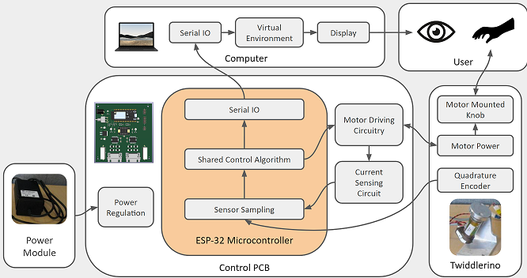
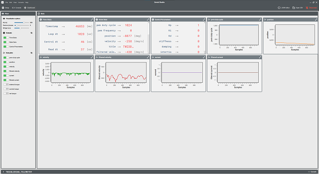

# HapticCopiloting
Codebase for our ENPH 459 Capstone Project: Haptic Co-Piloting.

1 DOF haptic device featuring a BDC motor control system in live feedback with a virtual environment.

## Directories
- twiddlerino: C source code for the Twiddlerino's ESP32
- sim: MATLAB source code for modelling and simualtion of motor, sensors and controller

## System Diagram

## Firmware Dev Environment

Embedded development environment: [Platformio](https://platformio.org/) IDE plugin for VSCode

[Install platformio](https://platformio.org/)

config file: `twiddlerino/platformio.ini`

## Telemetry System

[Serial Studio](https://serial-studio.github.io/), an open source telemetry GUI, is used to record and visualize system data during testing of the controller.

Serial data frames are defined in a .JSON configuration file, see `twiddlerino/serial-studio-dashboard.json`.

The firmware running on the ESP32 periodically sends telemetry strings over a serial port. The strings are formatted as serial studio frames: `"/*TWIDDLERINO_TELEMETRY,%s,%s,...,%s*/"`.

